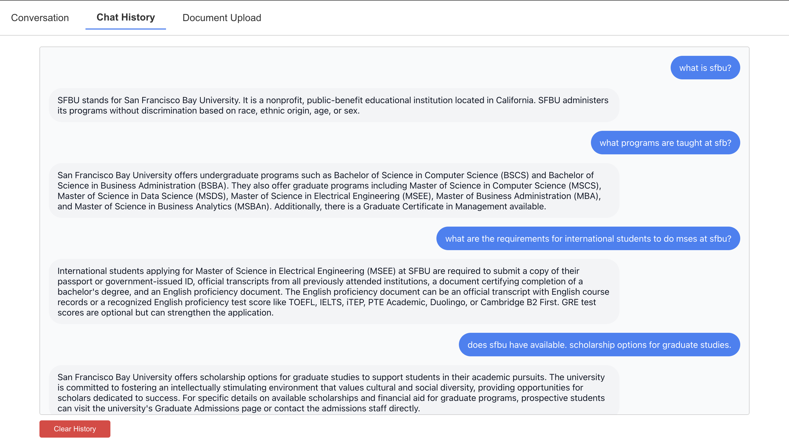
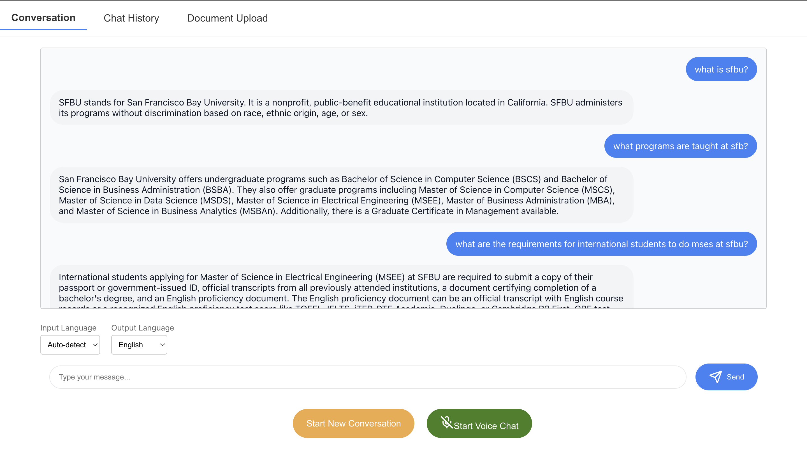
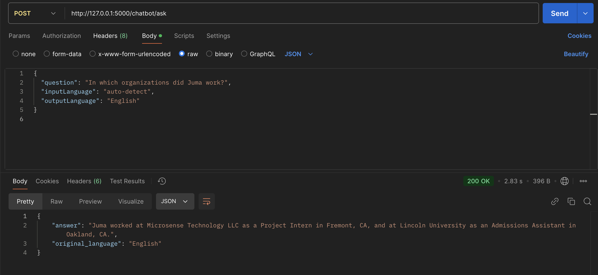

# AInfoQuery: AI-Powered Multimodal Chatbot for Document Interaction
🔗 Live App: [Access Here](https://ai-info-frontend.vercel.app/)

## Table of Contents

1. [Project Overview](#project-overview)
2. [Features](#features)
3. [Screenshots of Functionality](#screenshots-of-functionality)
4. [Built With](#built-with)
5. [Prerequisites](#prerequisites)
6. [Getting Started](#getting-started)
   - [Installation Prerequisites](#installation-prerequisites)
   - [Running the Project Locally](#running-the-project-locally)
   - [Quick Demo](#quick-demo)
7. [Core Modules](#core-modules)
8. [Further Development and Contribution Guidelines](#further-development-and-contribution-guidelines)

## Project Overview

**AInfoQuery** is an intelligent chatbot platform that combines multimodal capabilities to interact with documents, voice, and multilingual text inputs. Built with a robust Flask backend and an engaging React.js frontend, it enables users to ask questions about uploaded documents and receive accurate, context-aware responses. This project addresses the increasing reliance on diverse digital content like PDFs, PowerPoint presentations, web content and online videos by providing a single platform to query, analyze, and interact with such content efficiently.

## Features

- **Voice Interaction**: Wake word detection ("assistant") for hands-free interaction using natural speech
- **Multilingual Support**: Automatic language detection and seamless real-time translation
- **Document Processing**: Query PDF, PowerPoint, web URLs, and YouTube videos
- **Real-Time Conversion**: Speech-to-text and text-to-speech capabilities
- **Content Moderation**: Input sanitization and output filtering for safe usage
- **Context Awareness**: Conversation memory for intelligent, ongoing interactions
- **Vector Database Integration**: Efficient and scalable document retrieval using embeddings

## Screenshots of Functionality

Include visuals demonstrating:
1. Document upload interface and the React.js frontend


2. Chat history


3. Multilingual question and response in action


## Built With

- **Frontend**: React.js
- **Backend**: Flask
- **AI/ML**:
  - `gpt-3.5-turbo`: for text processing and translation
  - `tts-1`: for generating and playing speech
  - `OpenAI's moderations api`: for input and output moderation
  - `Google Cloud Speech-to-Text`: For voice recognition
  - `langdetect`: for recognizing text in different languages
- **Document Processing**:
  - `LangChain`: Text chunking and document handling
  - `PyPDF`: Handling PDF content
  - `YouTube-dl`: Extracting video transcriptions
- **Database**: 
   - `Chroma`: vector database for efficient document retrieval

## Prerequisites

Before starting, ensure you have:
- Python 3.7+
- Node.js and npm (for the React frontend)
- OpenAI API key
- Google Cloud credentials

## Getting Started

### Installation Prerequisites

1. Clone the repository:
   ```bash
   git clone https://github.com/juma-paul/ai-info-query.git
   cd backend
   ```

2. Set up the backend:
   ```bash
   python3 -m venv venv
   source venv/bin/activate  # On Windows: .\venv\Scripts\activate
   pip install -r requirements.txt
   ```

3. Configure environment variables in a `.env` file:
   ```env
   OPENAI_API_KEY=your_openai_api_key
   GOOGLE_APPLICATION_CREDENTIALS=path_to_google_credentials.json
   ```

4. Set up the frontend:
   ```bash
   cd frontend
   npm install
   ```

### Running the Project Locally

1. Start the backend:
   ```bash
   cd app
   export GOOGLE_APPLICATION_CREDENTIALS=path_to_google_credentials.json
   python3 main.py
   ```

2. Start the frontend:
   ```bash
   cd frontend
   npm start
   ```

3. Open your browser and navigate to `http://localhost:3000`

### Quick Demo

Here's an example of interacting with the chatbot:

1. Document Upload:
   - Go to the Upload Documents section
   - Choose a PDF file and upload it
   - Start querying the document using the chat interface

2. API Integration Example:


3. Voice Interaction:
   - Say "Assistant" to activate the wake word
   - Ask questions or give commands via your microphone

## Core Modules

### Document Processing Module

The document processing module handles the ingestion and processing of various document types:

- **Key Features**:
  - Multi-format document support (PDFs, PowerPoints, URLs, YouTube videos)
  - Document chunking and vectorization
  - Storage in Chroma vector database

**Key Endpoints**:
- `/upload-pdf`: Upload and process PDF files
- `/process-url`: Process web content
- `/process-video`: Process YouTube videos
- `/upload-ppt`: Upload and process .ppt/.pptx files

### Chatbot Module

The chatbot module manages all conversational interactions and document querying:

- **Key Features**:
  - AI-powered Q&A processing
  - Conversation memory management
  - Input moderation and sanitization
  - Multilingual query support with translation

**Key Endpoints**:
- `/ask`: Ask questions about processed documents
- `/clear-history`: Reset conversation memory
- `/available-languages`: Retrieve supported languages
- `/start-new-conversation`: Clears current conversation memory and starts a new one

### Audio Processing Module

The audio processing module handles all voice-based interactions:

- **Key Features**:
  - Wake/stop word detection
  - Speech-to-text conversion
  - Text-to-speech generation

**Key Endpoints**:
- `/speech_chat`: Begin voice interaction

## Further Development and Contribution Guidelines

### Contribution Guidelines

Contributions are highly welcomed! Please follow the steps outlined in the
[Git Workflow Guidelines](https://github.com/juma-paul/customer-support-system/blob/main/GIT_WORKFLOW.md) along with the following:

1. Fork the repository
2. Create a feature branch 
3. Commit your changes 
4. Push to the branch
5. Open a Pull Request

Development Guidelines:
- Follow PEP 8 for Python code style
- Write tests for any new functionality
- Ensure all existing tests pass before submitting

### Future Enhancements

- Implement additional document formats for processing
- Expand multi-language support to more languages
- Enhance the React.js frontend with more customization options
- Optimize the vector database for faster retrieval
- Implement a more robust way for handling the different languages

## License

This project is licensed under the [MIT License](https://opensource.org/license/mit)
